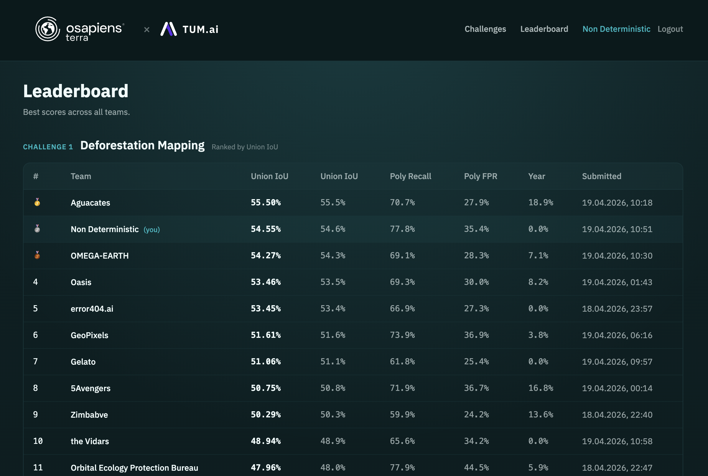

# Non Deterministic - osapiens Makeathon 2026

Deforestation detection submission for the osapiens Makeathon 2026 challenge.

## Result

Current best leaderboard result:

| Metric | Score |
| --- | ---: |
| Union IoU | 54.23% |
| Recall | 79.4% |
| False positive rate | 36.9% |
| Year error | 0.0% |



## Approach

Final model path:

- Build pseudo-ground-truth labels from RADD, GLAD-S2, and GLAD-L alerts.
- Extract all-year raw AEF embeddings for 2020-2025.
- Train tabular LightGBM and XGBoost models.
- Generate probability maps for the test tiles.
- Create thresholded GeoJSON submissions.
- Ensemble model outputs using:

```text
LGB > 0.25 OR (XGB > 0.17 AND LGB > 0.10)
```

The final submission notebook is:

```text
final_aef_lgbm_xgb_submission.ipynb
```

## UI / Agent

Project UI:

https://earth-view-monitor.lovable.app/

The UI/Agent is used to inspect areas, monitor earth observation signals, and support interaction around detected deforestation regions.

## Repository Notes

The final notebook keeps only the leaderboard-producing path:

- pseudo-GT label generation
- all-year AEF feature extraction
- LightGBM and XGBoost training
- threshold submissions
- ensemble submissions
- feature importance and run metadata

Old failed experiments and debugging notebooks are not part of the final pipeline.

## Authors

- Ahmed Elghobashy - ahmadsamir694@gmail.com
- Youssef Abdelaal - Youssef.e.amer@gmail.com
- Ahmed Maher
- Syrine
- Aaron
